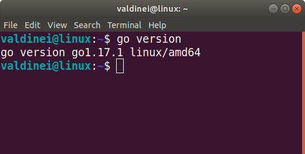
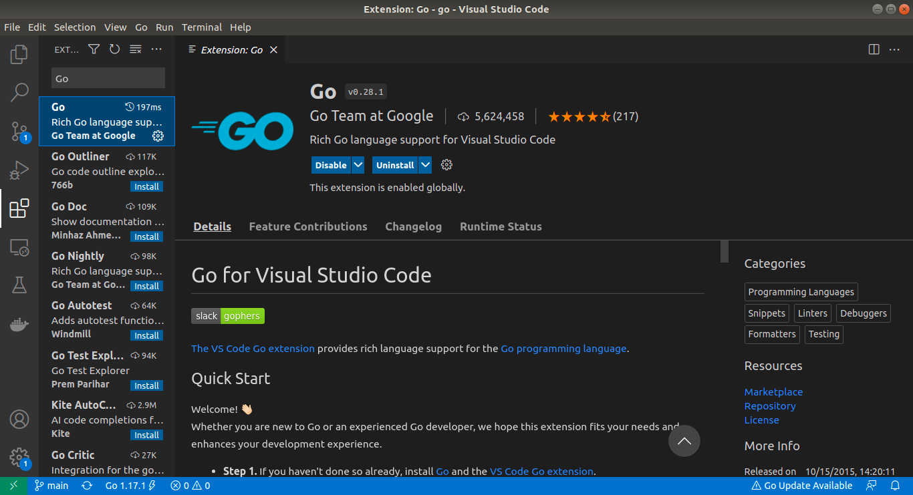
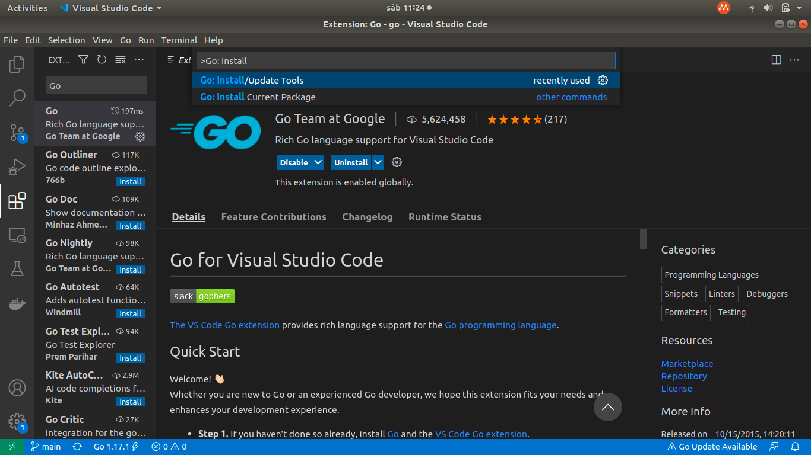
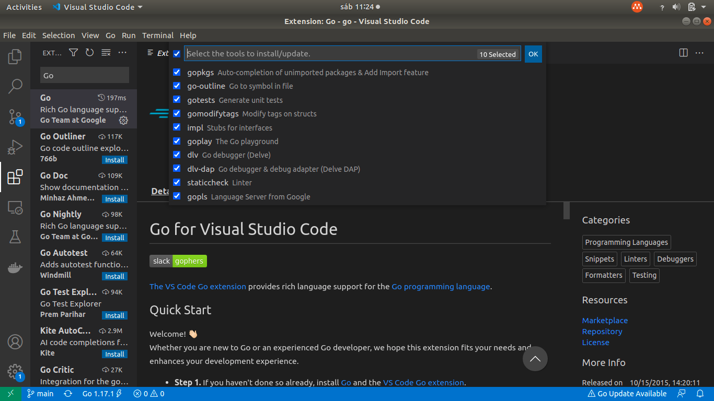
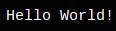
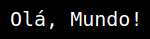

<html>
   <body>
      <article id="d8f09b2a-89e7-41fb-b2a7-b7e3550022df" class="page mono">
         <header>
            
 

            <h1 class="page-title">Go</h1>
            <table class="properties">
               <tbody>
                  <tr class="property-row property-row-select">
                     <th>
                        
                           <svg viewBox="0 0 14 14" style="width:14px;height:14px;display:block;fill:rgba(55, 53, 47, 0.4);flex-shrink:0;-webkit-backface-visibility:hidden" class="typesSelect">
                              <path d="M7,13 C10.31348,13 13,10.31371 13,7 C13,3.68629 10.31348,1 7,1 C3.68652,1 1,3.68629 1,7 C1,10.31371 3.68652,13 7,13 Z M3.75098,5.32278 C3.64893,5.19142 3.74268,5 3.90869,5 L10.09131,5 C10.25732,5 10.35107,5.19142 10.24902,5.32278 L7.15771,9.29703 C7.07764,9.39998 6.92236,9.39998 6.84229,9.29703 L3.75098,5.32278 Z"></path>
                           </svg>
                        
                        Level
                     </th>
                     <td>Introductory</td>
                  </tr>
                  <tr class="property-row property-row-relation">
                     <th>
                        
                           <svg viewBox="0 0 14 14" style="width:14px;height:14px;display:block;fill:rgba(55, 53, 47, 0.4);flex-shrink:0;-webkit-backface-visibility:hidden" class="typesRelation">
                              <polygon points="4.5 1 4.5 3 9.586 3 1 11.586 2.414 13 11 4.414 11 9.5 13 9.5 13 1"></polygon>
                           </svg>
                        
                        Related to Coding Projects (Files)
                     </th>
                     <td></td>
                  </tr>
                  <tr class="property-row property-row-multi_select">
                     <th>
                        
                           <svg viewBox="0 0 14 14" style="width:14px;height:14px;display:block;fill:rgba(55, 53, 47, 0.4);flex-shrink:0;-webkit-backface-visibility:hidden" class="typesMultipleSelect">
                              <path d="M4,3 C4,2.447715 4.447715,2 5,2 L12,2 C12.5523,2 13,2.447716 13,3 C13,3.55228 12.5523,4 12,4 L5,4 C4.447715,4 4,3.55228 4,3 Z M4,7 C4,6.447715 4.447715,6 5,6 L12,6 C12.5523,6 13,6.447716 13,7 C13,7.55228 12.5523,8 12,8 L5,8 C4.447715,8 4,7.55228 4,7 Z M4,11 C4,10.447715 4.447715,10 5,10 L12,10 C12.5523,10 13,10.447716 13,11 C13,11.55228 12.5523,12 12,12 L5,12 C4.447715,12 4,11.55228 4,11 Z M2,4 C1.44771525,4 1,3.55228475 1,3 C1,2.44771525 1.44771525,2 2,2 C2.55228475,2 3,2.44771525 3,3 C3,3.55228475 2.55228475,4 2,4 Z M2,8 C1.44771525,8 1,7.55228475 1,7 C1,6.44771525 1.44771525,6 2,6 C2.55228475,6 3,6.44771525 3,7 C3,7.55228475 2.55228475,8 2,8 Z M2,12 C1.44771525,12 1,11.5522847 1,11 C1,10.4477153 1.44771525,10 2,10 C2.55228475,10 3,10.4477153 3,11 C3,11.5522847 2.55228475,12 2,12 Z"></path>
                           </svg>
                        
                        Source
                     </th>
                     <td>W3Schools</td>
                  </tr>
                  <tr class="property-row property-row-select">
                     <th>
                        
                           <svg viewBox="0 0 14 14" style="width:14px;height:14px;display:block;fill:rgba(55, 53, 47, 0.4);flex-shrink:0;-webkit-backface-visibility:hidden" class="typesSelect">
                              <path d="M7,13 C10.31348,13 13,10.31371 13,7 C13,3.68629 10.31348,1 7,1 C3.68652,1 1,3.68629 1,7 C1,10.31371 3.68652,13 7,13 Z M3.75098,5.32278 C3.64893,5.19142 3.74268,5 3.90869,5 L10.09131,5 C10.25732,5 10.35107,5.19142 10.24902,5.32278 L7.15771,9.29703 C7.07764,9.39998 6.92236,9.39998 6.84229,9.29703 L3.75098,5.32278 Z"></path>
                           </svg>
                        
                        Status
                     </th>
                     <td>Ongoing</td>
                  </tr>
                  <tr class="property-row property-row-relation">
                     <th>
                        
                           <svg viewBox="0 0 14 14" style="width:14px;height:14px;display:block;fill:rgba(55, 53, 47, 0.4);flex-shrink:0;-webkit-backface-visibility:hidden" class="typesRelation">
                              <polygon points="4.5 1 4.5 3 9.586 3 1 11.586 2.414 13 11 4.414 11 9.5 13 9.5 13 1"></polygon>
                           </svg>
                        
                        Tags
                     </th>
                     <td></td>
                  </tr>
               </tbody>
            </table>
         </header>
         

            <h1 id="d6a3a47e-4869-4440-85f5-2dfbf5716d79" class="">Introdução ☑️</h1>
            

            <ul id="a2d1cccc-8267-408e-b584-9bd0763e89e2" class="toggle">
               <li>
                  

                     
<strong>O que é Go? </strong>🆗

                     <h2 id="3052fad0-5b43-4acf-9af5-cb4b64de98a0" class="">O que é Go?</h2>
                     <ul id="9a8c8189-2604-4fbb-bf28-56b5783a5c91" class="bulleted-list">
                        <li style="list-style-type:disc">Linguagem de programação <code>multiplataforma</code> (Windows, Mac, Linux, etc.).</li>
                     </ul>
                     <ul id="61fb03be-a600-4557-8d32-6e73eec39cd7" class="bulleted-list">
                        <li style="list-style-type:disc">Código <code>aberto</code>.</li>
                     </ul>
                     <ul id="b9b9e081-b886-4b61-9d5b-e1ad7b8d53ec" class="bulleted-list">
                        <li style="list-style-type:disc">Cria softwares de <code>alto desempenho</code>.</li>
                     </ul>
                     <ul id="6a636e33-c9d3-4fc7-b47b-f67dc3530048" class="bulleted-list">
                        <li style="list-style-type:disc"><code>Compilada</code> (mas parece interpretada).</li>
                     </ul>
                     <ul id="78207427-fb09-4be4-9fc4-f5ff0319b8a6" class="bulleted-list">
                        <li style="list-style-type:disc"><code>Tipagem estática</code> (mas parece dinâmica).</li>
                     </ul>
                     <ul id="19b5ae62-d14a-426b-9c17-b80a33f55ebb" class="bulleted-list">
                        <li style="list-style-type:disc">Desenvolvida no <code>Google</code> por Robert Griesemer, Rob Pike e Ken Thompson em <code>2007</code>.</li>
                     </ul>
                     

                  

               </li>
            </ul>
            <ul id="73f54e91-486b-4c91-be9e-ba2efd999346" class="toggle">
               <li>
                  

                     
<strong>Para que serve Go? </strong>🆗

                     <h2 id="62e9fcab-59e0-4738-8eb1-87b1311f5fb6" class=""><strong>Para que serve Go?</strong></h2>
                     <ul id="8c9dcc4a-7315-4b14-a5ed-7dfe29319e6e" class="bulleted-list">
                        <li style="list-style-type:disc">Desenvolvimento <code>web</code>.</li>
                     </ul>
                     <ul id="13108595-84d4-4887-982f-0aea07d05716" class="bulleted-list">
                        <li style="list-style-type:disc">Desenvolvimento de programas baseados em <code>rede</code>.</li>
                     </ul>
                     <ul id="185a1810-51b2-484b-8b5e-1a668463b256" class="bulleted-list">
                        <li style="list-style-type:disc">Desenvolvimento de <code>softwares empresariais multiplataforma</code>.</li>
                     </ul>
                     <ul id="023976e8-505c-4d7a-9328-faf4c8c08637" class="bulleted-list">
                        <li style="list-style-type:disc">Desenvolvimento <code>nativo em nuvem</code>.</li>
                     </ul>
                     

                  

               </li>
            </ul>
            <ul id="6ef8ba4e-024b-4523-838a-0ae07ab79fc4" class="toggle">
               <li>
                  

                     
<strong>Por que usar Go? </strong>🆗

                     <h2 id="d8cf5008-26bf-4c88-b59b-0e2309aad13b" class="">Por que usar Go?</h2>
                     <ul id="a8603d2e-5b0c-4c56-907a-be42da619eb5" class="bulleted-list">
                        <li style="list-style-type:disc">É divertido e fácil de <code>aprender</code>.</li>
                     </ul>
                     <ul id="5630c574-12d7-4ad9-a66a-6e9398e450e1" class="bulleted-list">
                        <li style="list-style-type:disc">Rápido <code>tempo de compilação</code>.</li>
                     </ul>
                     <ul id="59452bed-c0d4-434c-9679-b7c38487a169" class="bulleted-list">
                        <li style="list-style-type:disc">Rápido <code>tempo de execução</code>.</li>
                     </ul>
                     <ul id="947b41e1-4f0e-4a6d-a916-437772c3abfb" class="bulleted-list">
                        <li style="list-style-type:disc">Oferece suporte à <code>simultaneidade</code>.</li>
                     </ul>
                     <ul id="7645fa00-642b-49a3-b6fd-d6495a5db74a" class="bulleted-list">
                        <li style="list-style-type:disc">Permite o <code>gerenciamento de memória</code>.</li>
                     </ul>
                     <ul id="dff1f022-6e66-4858-9fb8-ff7fde1140a4" class="bulleted-list">
                        <li style="list-style-type:disc">Roda em <code>diferentes plataformas</code> (Windows, Mac, Linux, Raspberry Pi, etc.).</li>
                     </ul>
                     

                  

               </li>
            </ul>
            <ul id="9bbe572b-7588-44e9-94fd-9ba762425130" class="toggle">
               <li>
                  

                     
<strong>Características do Go </strong>🆗

                     <h2 id="8ac0a14f-59cc-4e5b-bfb1-ebd3c9513dd0" class="">Características do Go</h2>
                     <ul id="23f2d619-6ea3-41e0-a4da-be9191a1d3d2" class="bulleted-list">
                        <li style="list-style-type:disc">Tipagem <code>estática</code>.</li>
                     </ul>
                     <ul id="40388b6f-2b58-40bf-829c-e58a818dcfeb" class="bulleted-list">
                        <li style="list-style-type:disc"><code>Compilada</code>.</li>
                     </ul>
                     <ul id="5f299af2-a47b-4521-958a-3ccbaa55621c" class="bulleted-list">
                        <li style="list-style-type:disc">Rápido <code>tempo de compilação</code>.</li>
                     </ul>
                     <ul id="c8f0b416-695b-4a9c-b544-aec0581a3e52" class="bulleted-list">
                        <li style="list-style-type:disc">Rápido <code>tempo de execução</code>.</li>
                     </ul>
                     <ul id="ec72462b-3fbc-414f-a15c-0bd05194cb77" class="bulleted-list">
                        <li style="list-style-type:disc">Oferece suporte à <code>simultaneidade</code> através de goroutines e channel.</li>
                     </ul>
                     <ul id="ad0238a7-3b91-497a-ba24-44fea858c275" class="bulleted-list">
                        <li style="list-style-type:disc">Possui <code>coleta de lixo</code> automática.</li>
                     </ul>
                     <ul id="2288b19a-735c-4304-966a-bad29b326e3c" class="bulleted-list">
                        <li style="list-style-type:disc">Não suporta <code>classes e objetos</code> (pelo menos não da forma tradicional).</li>
                     </ul>
                     <ul id="3ae1fa2c-3ec5-4660-b395-5f7656db18eb" class="bulleted-list">
                        <li style="list-style-type:disc">Não suporta <code>herança</code> (pelo menos não da forma tradicional).</li>
                     </ul>
                     

                  

               </li>
            </ul>
            <ul id="9870bfd9-7eab-4700-8b67-a26bb6297243" class="toggle">
               <li>
                  

                     
<strong>Notas </strong>🆗

                     <h2 id="a9d05b01-229d-4416-8224-8873a4be4505" class="">Notas</h2>
                     <ul id="f0e76e67-a0e5-40ff-a2bc-49f33cb60fe9" class="bulleted-list">
                        <li style="list-style-type:disc">O tempo de execução se refere ao tempo de <code>tradução</code> do código em um programa executável.</li>
                     </ul>
                     <ul id="4c85459a-df31-41e6-91ae-56f9b13152ef" class="bulleted-list">
                        <li style="list-style-type:disc">Simultaneidade é <code>fazer várias coisas</code> fora de ordem ou ao mesmo tempo, sem afetar o resultado final.</li>
                     </ul>
                     <ul id="fa6d8fe4-a8aa-4835-acf7-25c1addd2535" class="bulleted-list">
                        <li style="list-style-type:disc">Ser estaticamente tipado significa que os tipos da variáveis são conhecidos em <code>tempo de compilação</code>.</li>
                     </ul>
                     

                  

               </li>
            </ul>
            <h1 id="47732c8c-da8b-4edb-ba1a-e4904a6573aa" class="">Primeiros passos ☑️</h1>
            

            <ul id="e05bc1bc-1390-4f0d-ad87-ced7e2aae696" class="toggle">
               <li>
                  

                     
<strong>Ferramentas necessárias </strong>🆗

                     <h2 id="b39eb3ff-19d3-4351-a778-114a92ff1954" class=""><strong>Ferramentas necessárias</strong></h2>
                     <ul id="7a6e52dc-4d17-4ee3-b7f5-042797fc2a15" class="bulleted-list">
                        <li style="list-style-type:disc">Um <code>editor de texto</code> ou um de <code>IDE</code> para escrever os códigos.</li>
                     </ul>
                     <ul id="9b569318-b4bc-48df-9d0f-bfca02b8f734" class="bulleted-list">
                        <li style="list-style-type:disc">Um <code>compilador</code> para traduzir o código para uma linguagem que o computador entenda.</li>
                     </ul>
                     

                  

               </li>
            </ul>
            <ul id="8d5cc92f-7e75-4658-91e4-86eb4b60b5e0" class="toggle">
               <li>
                  

                     
<strong>Instalação do Go </strong>🆗

                     <h2 id="ea4718a4-a872-4911-82d6-b91e18e09098" class=""><strong>Instalação do Go</strong></h2>
                     <ul id="c684ff66-cac8-46fa-b713-1e5cc4c14adf" class="bulleted-list">
                        <li style="list-style-type:disc">Baixe os arquivos de instalação do Go no site <code><a href="https://golang.org/dl/">golang.org/dl</a></code> de acordo com o seu sistema operacional e os instale.</li>
                     </ul>
                     <ul id="faf4e6fd-fd95-40c3-9d55-e5484b2989b0" class="bulleted-list">
                        <li style="list-style-type:disc">
                           Para verificar se o Go foi instalado com sucesso, execute o comando <code>go version</code> na linha de comando do seu sistema operacional.
                           <figure id="5211a78a-cf6e-4f5d-a5f9-49f77fa60a77" class="image"><a href="images/Screenshot_from_2021-10-09_11-05-38.png"> </a></figure>
                        </li>
                     </ul>
                     

                  

               </li>
            </ul>
            <ul id="aa9a7283-6369-4a4d-bed0-d617ae104c2d" class="toggle">
               <li>
                  

                     
<strong>Instalação do VS Code </strong>🆗

                     <h2 id="f2077cd7-e44f-40d8-a172-a24cf5520ac6" class=""><strong>Instalação do VS Code</strong></h2>
                     <ul id="ba622175-3d38-4a3a-a4ff-7d6509c550b7" class="bulleted-list">
                        <li style="list-style-type:disc">Baixe e instale a versão mais recente no endereço <code><a href="https://code.visualstudio.com/">code.visualstudio.com</a></code>.</li>
                     </ul>
                     

                  

               </li>
            </ul>
            <ul id="e1c46771-2287-458e-85fb-2eccca18abbc" class="toggle">
               <li>
                  

                     
<strong>Configuração do VS Code </strong>🆗

                     <h2 id="8570c489-78ae-4ddd-808e-01d0df02e7c3" class=""><strong>Configuração do VS Code</strong></h2>
                     <ul id="40d4dd27-9eef-4a0d-a702-aedea355dfcb" class="bulleted-list">
                        <li style="list-style-type:disc">Abra o <code>VS Code</code>.</li>
                     </ul>
                     <ul id="ece22d78-d4b4-4639-ab9d-c7341e0a2731" class="bulleted-list">
                        <li style="list-style-type:disc">Abra o gerenciador de extensões (<code>Ctrl + Shift + X</code>).</li>
                     </ul>
                     <ul id="f4e28f57-df8a-4540-bfe7-3554c86408f3" class="bulleted-list">
                        <li style="list-style-type:disc">Digite <code>Go</code> e pressione a tecla <code>Enter</code>.</li>
                     </ul>
                     <ul id="bdd3e1ad-7daa-4bdf-8b9c-abf991228984" class="bulleted-list">
                        <li style="list-style-type:disc">
                           Encontre e instale a extensão <code>Go</code> desenvolvida pelo <code>Go Team at Google</code>.
                           <figure id="9806e23d-1d1b-4667-9c13-44a8e28f849a" class="image"><a href="images/Screenshot_from_2021-10-09_11-20-20.png"> </a></figure>
                        </li>
                     </ul>
                     <ul id="8382669f-18ac-4ff4-ba7d-e82d0de67a38" class="bulleted-list">
                        <li style="list-style-type:disc">Abra a paleta de comandos (<code>Ctrl + Shift + P</code>).</li>
                     </ul>
                     <ul id="34e78391-4d34-4fdf-b834-cb7dcaf63eaf" class="bulleted-list">
                        <li style="list-style-type:disc">
                           Pesquise e execute <code>Go: Install/Update Tools</code>.
                           <figure id="fd5ec7b2-9645-49c6-b31f-daee5aa480ad" class="image"><a href="images/Screenshot_from_2021-10-09_11-24-18.png"> </a></figure>
                        </li>
                     </ul>
                     <ul id="f9bcdacc-86b8-45a2-967d-06402189932e" class="bulleted-list">
                        <li style="list-style-type:disc">
                           Selecione <code>todas</code> as ferramentas (marque todos as caixas de seleção) e clique em OK.
                           <figure id="4fd36f8f-b9d0-4568-a034-fff38ace3a01" class="image"><a href="images/Screenshot_from_2021-10-09_11-24-29.png"> </a></figure>
                        </li>
                     </ul>
                     <ul id="05c6d240-7f67-4af4-b5dc-efb70dd8dfed" class="bulleted-list">
                        <li style="list-style-type:disc">Agora o VS Code está configurado para usar o Go!</li>
                     </ul>
                     

                  

               </li>
            </ul>
            <ul id="5e8058eb-3b79-45f9-9d9f-9084cdc951ff" class="toggle">
               <li>
                  

                     
<strong>Primeiro programa em Go </strong>🆗

                     <h2 id="14128b15-5c59-4c0f-9a37-698744b573d5" class=""><strong>Primeiro programa em Go</strong></h2>
                     <ul id="1d26d69c-0e83-4497-b0f8-c82d1b397fe4" class="bulleted-list">
                        <li style="list-style-type:disc">Abra uma janela de terminal no VS Code (<code>Ctrl + Shift + ´</code> ou <code>Ctrl + J</code>).</li>
                     </ul>
                     <ul id="6fd967cf-520a-4296-8162-7c6d510be362" class="bulleted-list">
                        <li style="list-style-type:disc">
                           Digite <code>go mod init exemplo.com/primeiro-programa</code> e pressione <code>Enter</code>.
                           <figure id="83d45e4e-c07a-4232-af55-10c5c2ec1bbc" class="image"><a href="images/Untitled.png"> </a></figure>
                        </li>
                     </ul>
                     <ul id="1ebaa499-11f9-42ef-8a90-6a3630fcfb97" class="bulleted-list">
                        <li style="list-style-type:disc">
                           Crie um novo arquivo <code>File &gt; New File</code> ou pressione <code>Ctrl + N</code>.
                           <figure id="77c86d37-f9f9-478b-afcc-376e5ede3db9" class="image"><a href="images/Untitled%201.png"> </a></figure>
                        </li>
                     </ul>
                     <ul id="c5a81427-815b-4859-bb44-e9779122a75c" class="bulleted-list">
                        <li style="list-style-type:disc">
                           Escreva o seguinte código e salve com o nome <code>primeiro-programa.go</code>:
                           <pre id="98d5b117-cbf8-42ba-a404-116aa807f9eb" class="code"><code>package main

import (
	&quot;fmt&quot;
)

func main() {
	fmt.Println(&quot;Hello, World!&quot;)
}</code></pre>
                        </li>
                     </ul>
                     <ul id="8708faf9-cfc5-48d7-81a6-0a4802152f33" class="bulleted-list">
                        <li style="list-style-type:disc">
                           Execute na linha de comando <code>go run primeiro-programa.go</code> para rodá-lo.
                           <figure id="bcff5675-9c30-4149-8391-88d3480f3336" class="image"><a href="images/Untitled%202.png"> </a></figure>
                        </li>
                     </ul>
                     <ul id="53c4b6b0-8ca5-4ac5-b705-2a005fcc05f0" class="bulleted-list">
                        <li style="list-style-type:disc">
                           Para criar um executável do seu programa, execute <code>go build primeiro-programa.go</code>.
                           <figure id="56a53769-759a-4860-a9c6-0ec2d5c28842" class="image"><a href="images/Untitled%203.png"> </a></figure>
                        </li>
                     </ul>
                     <ul id="d09ee28f-e3cb-407c-b9cd-3bb38cc75007" class="bulleted-list">
                        <li style="list-style-type:disc">
                           Para rodar o executável (no Linux) é preciso apenas executar <code>./primeiro-programa</code>.
                           <figure id="504324fb-f784-4640-a46e-eb8ee5a3052d" class="image"><a href="images/Untitled%204.png"> </a></figure>
                        </li>
                     </ul>
                     

                  

               </li>
            </ul>
            <h1 id="d1ed08c9-97b2-4236-9cab-d317ae637941" class="">Sintaxe ☑️</h1>
            

            <ul id="b2f9fef1-4f88-4c1d-a22f-fc3c2645530f" class="toggle">
               <li>
                  

                     
<strong>Partes de um arquivo Go </strong>🆗

                     <h2 id="9a7a19f9-a886-4882-a163-3930981d65b2" class="">Partes de um arquivo Go</h2>
                     <ul id="bb2ef3e2-5ca9-4c3b-a11e-59c6ab8c3b02" class="bulleted-list">
                        <li style="list-style-type:disc">Declaração do pacote.</li>
                     </ul>
                     <ul id="d0600131-9cb2-4269-a0b0-d5960653fe30" class="bulleted-list">
                        <li style="list-style-type:disc">Importação de pacotes.</li>
                     </ul>
                     <ul id="6e8ed813-b767-468b-bb5e-3f84ab88d435" class="bulleted-list">
                        <li style="list-style-type:disc">Funções.</li>
                     </ul>
                     <ul id="8d1170fc-4ea7-4348-a371-1683b3c8dfdb" class="bulleted-list">
                        <li style="list-style-type:disc">
                           Declarações e expressões.
                           <pre id="752b7bb7-e893-4bc8-a7f6-f30d9a71ff55" class="code"><code>// Pacote principal.
package main

// Importação de pacotes.
import (
	&quot;fmt&quot;
)

// Função principal.
func main() {
	// Declaração de impressão de uma mensagem na tela.
	fmt.Println(&quot;Hello, World!&quot;)
}</code></pre>
                           <figure id="5d2c361e-9690-475e-b308-2d2adcf89224" class="image"><a href="images/Screenshot_from_2021-10-09_12-39-56.png"> </a></figure>
                        </li>
                     </ul>
                     <ul id="156cf168-0757-4851-9ae2-9b24e1d578fb" class="bulleted-list">
                        <li style="list-style-type:disc">Em Go, todo programa faz parte de um pacote (<code>package</code>).</li>
                     </ul>
                     <ul id="af44d270-04aa-49a6-b301-94c143bec8da" class="bulleted-list">
                        <li style="list-style-type:disc">A palavra reservada <code>import</code> nos permite importar outros pacotes para utilizar suas funções.</li>
                     </ul>
                     <ul id="3bf2a234-b214-471b-9641-24bf56627443" class="bulleted-list">
                        <li style="list-style-type:disc"><code>fmt</code> é um pacote que nos permite utilizar funções de entrada e saída de dados.</li>
                     </ul>
                     <ul id="082ac0ec-5b71-4516-a29a-c828bd4a8baf" class="bulleted-list">
                        <li style="list-style-type:disc">O Go ignora <code>espaços em branco</code>. Aproveite isso para dar mais <code>legibilidade</code> ao código.</li>
                     </ul>
                     <ul id="f2e22316-c75c-4e34-b179-a4e2b9eb296a" class="bulleted-list">
                        <li style="list-style-type:disc">O que estiver dentro da função principal (<code>func main() {...}</code>) será executado.</li>
                     </ul>
                     <ul id="12c81181-4a61-47a2-a9a2-7e7516390349" class="bulleted-list">
                        <li style="list-style-type:disc">A função <code>fmt.Println()</code> foi disponibilizada pelo pacote <code>fmt</code> e nos permite <code>imprimir textos</code> para o usuário.</li>
                     </ul>
                     

                  

               </li>
            </ul>
            <ul id="da80ad75-d6a5-4125-b292-ad70e276cd13" class="toggle">
               <li>
                  

                     
<strong>Declarações </strong>🆗

                     <h2 id="47e2efc3-a923-4a8f-b8ef-271b93793af4" class=""><strong>Declarações</strong></h2>
                     <ul id="997d5997-6db9-4c6e-815e-6efae31baf68" class="bulleted-list">
                        <li style="list-style-type:disc"><code>fmt.Println(&quot;Hello, World!&quot;)</code> é uma declaração.</li>
                     </ul>
                     <ul id="d4194881-b53e-4744-941b-8f9fbd4c65d1" class="bulleted-list">
                        <li style="list-style-type:disc">Em Go, as declarações são separadas pela quebra de linha (<code>Enter</code>) ou por um ponto e vírgula (<code>;</code>).</li>
                     </ul>
                     <ul id="6f047df0-d2be-4981-953e-7515b89b5e7e" class="bulleted-list">
                        <li style="list-style-type:disc">Pressionar a tecla <code>Enter</code> adiciona um ponto e vírgula de forma implícita.</li>
                     </ul>
                     <ul id="f901978d-60cf-420d-86d1-5cbbb5b28d7d" class="bulleted-list">
                        <li style="list-style-type:disc">
                           Portanto, a chave esquerda (<code>{</code>) não pode vir no início de uma linha de código.
                           <figure id="419b62bb-0e30-4872-bb72-4e13707889aa" class="image"><a href="images/Untitled%205.png"> </a></figure>
                        </li>
                     </ul>
                     

                  

               </li>
            </ul>
            <ul id="6ca9b73f-d016-40a2-b04a-9aced0b5bb1d" class="toggle">
               <li>
                  

                     
<strong>Código compacto </strong>🆗

                     <h2 id="76d9d0f0-11ff-4509-ba37-1fb86a9d2289" class="">Código compacto</h2>
                     <ul id="fe771796-13ef-4d78-887a-52cc8043d39e" class="bulleted-list">
                        <li style="list-style-type:disc">
                           Você até pode escrever um código como o abaixo, mas isso não é recomendado por <code>dificultar a legibilidade</code>.
                           <pre id="70b62029-3783-48ad-b4f2-8a08a21224d1" class="code"><code>package main; import (&quot;fmt&quot;); func main() { fmt.Println(&quot;Hello, World!&quot;);}</code></pre>
                        </li>
                     </ul>
                     

                  

               </li>
            </ul>
            <h1 id="729f3f1c-49ec-47cd-9120-83a6b0ef64ec" class="">Comentários ☑️</h1>
            <ul id="219a9087-ebb1-4136-a0f8-09ce47f1be12" class="toggle">
               <li>
                  

                     
<strong>O que são e para que servem? </strong>🆗

                     <h2 id="288c0a5a-4a0d-4ebe-9c06-815e30817ff0" class=""><strong>O que são e para que servem?</strong></h2>
                     <ul id="5b77709e-6077-4518-ab6e-d529165d4934" class="bulleted-list">
                        <li style="list-style-type:disc">Um comentário é um texto que é <code>ignorado</code> na execução do programa.</li>
                     </ul>
                     <ul id="78186e25-98ec-425b-a19b-87d2184dabbb" class="bulleted-list">
                        <li style="list-style-type:disc">Podem ser usados para <code>explicar</code> o código e/ou torná-lo <code>legível</code>.</li>
                     </ul>
                     <ul id="02219481-4d14-4c0e-b35d-8d715c5f2b8a" class="bulleted-list">
                        <li style="list-style-type:disc">Também usamos comentários para <code>evitar</code> que certo trecho de código seja executado quando estamos testando um código alternativo.</li>
                     </ul>
                     

                  

               </li>
            </ul>
            <ul id="66345e0e-5ae8-46b6-99ce-55fb807c1cd3" class="toggle">
               <li>
                  

                     
<strong>Comentários de uma só linha </strong>🆗

                     <h2 id="d253571c-0fc5-4347-a74f-565991f0e617" class=""><strong>Comentários de uma só linha</strong></h2>
                     <ul id="f6a833f8-e5df-4fae-ae19-554a9765e076" class="bulleted-list">
                        <li style="list-style-type:disc">São representados por <code>//</code>.</li>
                     </ul>
                     <ul id="f2a851f7-ebd3-458a-bb1e-3584bd3e324d" class="bulleted-list">
                        <li style="list-style-type:disc">Qualquer texto entre <code>//</code> e o <code>final da linha</code> será ignorado pelo compilador.</li>
                     </ul>
                     <pre id="c7a10193-9f9b-4349-8cda-9251b1762dcf" class="code"><code>// Isto é um comentário.
package main

import (
	&quot;fmt&quot;
)

func main() {
	fmt.Println(&quot;Hello, World!&quot;) // Isto é outro exemplo de comentário.
}</code></pre>
                     <figure id="a07725db-beb2-42a8-ab8b-13088caba3a9" class="image"><a href="images/Screenshot_from_2021-10-09_12-39-56.png"> </a></figure>
                     

                  

               </li>
            </ul>
            <ul id="d5f6463b-3aa4-47da-9990-ad61d1aa781b" class="toggle">
               <li>
                  

                     
<strong>Comentários de várias linhas </strong>🆗

                     <h2 id="606c9030-ec17-4dbf-980c-f82f597c6a29" class=""><strong>Comentários de várias linhas</strong></h2>
                     <ul id="e35b9ae4-14c6-433e-9a64-61e3cbac7b3e" class="bulleted-list">
                        <li style="list-style-type:disc">Começam com <code>/*</code> e terminam com <code>*/</code>.</li>
                     </ul>
                     <ul id="9e1bea04-6593-4345-b39a-a1e51d5e3a4a" class="bulleted-list">
                        <li style="list-style-type:disc">Qualquer coisa entre <code>/*</code> e <code>*/</code> não será executada.</li>
                     </ul>
                     <pre id="9b1ea040-6e9f-40d7-8f46-c29f6448afb9" class="code"><code>package main

import (
	&quot;fmt&quot;
)

func main() {
	/* Isto é um 
	comentário 
	multilina. */
	fmt.Println(&quot;Hello, World!&quot;)
}</code></pre>
                     <figure id="e3c1659e-906d-4e45-a4e5-09f8108a1c9f" class="image"><a href="images/Screenshot_from_2021-10-09_12-39-56.png"> </a></figure>
                     

                  

               </li>
            </ul>
            <ul id="4374bf4c-24d3-4bf7-ba57-2b9f68a5f003" class="toggle">
               <li>
                  

                     
<strong>Evitando a execução de código </strong>🆗

                     <h2 id="a3dc3496-56bd-4ac5-96e6-5dc896009a0e" class=""><strong>Evitando a execução de código</strong></h2>
                     <ul id="d22a0f3b-5dfe-4377-9292-914f7c91ec52" class="bulleted-list">
                        <li style="list-style-type:disc">Os comentários podem ser usados para <code>evitar a execução</code> de um código, quando estamos testando um código alternativo.</li>
                     </ul>
                     <pre id="71067a8f-3566-417c-ac93-d175f47223f0" class="code"><code>package main

import (
	&quot;fmt&quot;
)

func main() {
	// fmt.Println(&quot;Hello, World!&quot;)
	fmt.Println(&quot;Olá, Mundo!&quot;)
}</code></pre>
                     <figure id="6d4c64b3-4bdf-42e5-84f0-c855af5cb371" class="image"><a href="images/Screenshot_from_2021-10-09_15-09-19.png"> </a></figure>
                     

                  

               </li>
            </ul>
            <h1 id="f7e01e75-bb2d-401d-abbf-0788b072b6e7" class="">Variáveis ☑️</h1>
            <ul id="1419d96c-d3cd-4a38-b431-64e3738df107" class="toggle">
               <li>
                  

                     
<strong>O que são? </strong>🆗

                     <h2 id="0c808c63-ce91-4ebd-a061-ca13920cd96c" class="">O que são?</h2>
                     <ul id="d12cc704-107f-4ab8-9485-4f83fcdbae36" class="bulleted-list">
                        <li style="list-style-type:disc">Variáveis são contêineres que <code>armazenam</code> valores de dados.</li>
                     </ul>
                     

                  

               </li>
            </ul>
            <ul id="49062d5c-82ab-4144-907b-64f976dcb1ed" class="toggle">
               <li>
                  

                     
<strong>Tipos </strong>🆗

                     <h2 id="c2c058ac-a74a-4bc0-abe3-78655422a0b1" class=""><strong>Tipos</strong></h2>
                     <ul id="0025bba8-ff9d-40bf-9300-3058ebda87eb" class="bulleted-list">
                        <li style="list-style-type:disc"><code>int</code> - armazenam números <mark class="highlight-blue"><code>inteiros</code></mark>.</li>
                     </ul>
                     <ul id="5de1443d-d3f7-4bf5-bbc7-f88915e64212" class="bulleted-list">
                        <li style="list-style-type:disc"><code>float32</code> - armazenam números <mark class="highlight-blue"><code>decimais</code></mark>.</li>
                     </ul>
                     <ul id="2b3e33ed-70f5-4fc8-9580-5679a98126d5" class="bulleted-list">
                        <li style="list-style-type:disc"><code>string</code> - armazenam <mark class="highlight-blue"><code>textos</code></mark> entre <mark class="highlight-orange"><code>aspas duplas</code></mark>.</li>
                     </ul>
                     <ul id="bcb0ef03-40f1-4b66-a175-b41abc55b6d3" class="bulleted-list">
                        <li style="list-style-type:disc"><code>bool</code> - armazenam <mark class="highlight-blue"><code>true</code></mark> ou <mark class="highlight-blue"><code>false</code></mark>.</li>
                     </ul>
                     

                  

               </li>
            </ul>
            <ul id="1b99d40e-ae41-480a-a970-b554aabbc91d" class="toggle">
               <li>
                  

                     
<strong>Formas de declaração </strong>🆗

                     <h2 id="76853e9c-bf66-4bcf-80f6-1f7c9c1e4c2d" class=""><strong>Formas de declaração</strong></h2>
                     <ul id="de76b2bd-cbfc-45a9-8091-784b47098359" class="bulleted-list">
                        <li style="list-style-type:disc">
                           <code>var</code> nomeDaVariavel tipo = valor
                           <ul id="6bbc68a6-8a2b-418c-a996-b02e52b10965" class="bulleted-list">
                              <li style="list-style-type:circle">Você sempre deve especificar o <mark class="highlight-blue"><code>tipo</code></mark>, o <mark class="highlight-orange"><code>valor</code></mark> ou os <mark class="highlight-teal"><code>dois</code></mark>.</li>
                           </ul>
                        </li>
                     </ul>
                     <ul id="c6351c11-3513-4c04-9613-b1757186adb2" class="bulleted-list">
                        <li style="list-style-type:disc">
                           nomeDaVariavel <code>:=</code> valor
                           <ul id="513655f6-dee6-46fd-a0d9-3824887c951e" class="bulleted-list">
                              <li style="list-style-type:circle">O compilador vai <code>inferir</code> o tipo da variável baseado no valor.</li>
                           </ul>
                        </li>
                     </ul>
                     

                  

               </li>
            </ul>
            <ul id="8f934645-4cd0-46fa-a3c1-e906b18e6d23" class="toggle">
               <li>
                  

                     
<strong>Declaração com valor inicial </strong>🆗

                     <h2 id="c2a7a18b-c3e7-4312-8b03-3f59bef4f72d" class=""><strong>Declaração com valor inicial</strong></h2>
                     <pre id="686f558d-c038-45c7-abff-12e13ec630f3" class="code"><code>package main

import (
	&quot;fmt&quot;
)

func main() {
	var um string = &quot;um&quot; // tipo string
	var dois = &quot;dois&quot;    // tipo inferido
	tres := 3            // tipo inferido

	fmt.Println(um)
	fmt.Println(dois)
	fmt.Println(tres)
}</code></pre>
                     

                  

               </li>
            </ul>
            <ul id="116d4d31-dea0-44c2-9853-77cc7970ce0f" class="toggle">
               <li>
                  

                     
<strong>Declaração sem valor inicial </strong>🆗

                     <h2 id="b76f0133-17a6-44e0-a9c3-146722f5509f" class=""><strong>Declaração sem valor inicial</strong></h2>
                     <ul id="ce936ba4-dcde-4615-87fe-b2cf6073e400" class="bulleted-list">
                        <li style="list-style-type:disc">Em Go, todas as variáveis são <code>inicializadas</code>.</li>
                     </ul>
                     <ul id="f8a5b5bc-6b66-4350-ad86-967f4ab64146" class="bulleted-list">
                        <li style="list-style-type:disc">Se você declarar um variável mas não a inicializar, ela será automaticamente inicializada com o <code>valor zero padrão</code> do seu tipo.</li>
                     </ul>
                     <pre id="85b6906c-726c-4d8f-820c-d3c2979ed060" class="code"><code>package main

import (
	&quot;fmt&quot;
)

func main() {
	var a string  // &quot;&quot;
	var b int     // 0
	var c float32 // 0
	var d bool    // false

	fmt.Println(a)
	fmt.Println(b)
	fmt.Println(c)
	fmt.Println(d)
}</code></pre>
                     

                  

               </li>
            </ul>
            <ul id="f0a8fafa-a9d0-4875-a979-9b5c4737c480" class="toggle">
               <li>
                  

                     
<strong>Atribuição após declaração </strong>🆗

                     <h2 id="4775e059-1811-4bb7-a96d-ab25e03c44ab" class="">Atribuição após declaração</h2>
                     <ul id="f3d82ea0-17aa-46a2-b077-15d5429c1284" class="bulleted-list">
                        <li style="list-style-type:disc">Só é possível usando o <code>var</code>. Com <mark class="highlight-blue"><code>:=</code></mark> não dá.</li>
                     </ul>
                     <pre id="ee36473b-962e-4ec0-a896-0e0bab935bd1" class="code"><code>package main

import (
	&quot;fmt&quot;
)

func main() {
	var meuNome string
	meuNome = &quot;Felipe&quot;
	fmt.Println(meuNome)
}</code></pre>
                     

                  

               </li>
            </ul>
            <ul id="578f6393-b0bf-4e50-afe3-1ac74d1fb5c4" class="toggle">
               <li>
                  

                     
<strong>Diferença entre var e := </strong>🆗

                     <h2 id="104edb20-d45d-451a-9901-6a75f2873a82" class="">Diferença entre var :=</h2>
                     <ul id="4a31feea-d096-4369-b9a6-9f847ab3c927" class="bulleted-list">
                        <li style="list-style-type:disc"><code>var</code> pode ser usado dentro e fora de funções.</li>
                     </ul>
                     <ul id="82c4879f-6e07-4a94-9e97-8339d8421c8c" class="bulleted-list">
                        <li style="list-style-type:disc">A declaração com <code>var</code> permite <mark class="highlight-blue"><code>posterior inicialização</code></mark>.</li>
                     </ul>
                     <ul id="e2f66b2e-01c2-4d6a-b3ae-f7cf852d3166" class="bulleted-list">
                        <li style="list-style-type:disc"><code>:=</code> só pode ser usado dentro de funções.</li>
                     </ul>
                     <ul id="65cdda23-c999-48e9-aeef-5293d88d2ccc" class="bulleted-list">
                        <li style="list-style-type:disc">A declaração com <code>:=</code> <mark class="highlight-red"><strong>não</strong></mark> permite posterior inicialização.</li>
                     </ul>
                     <pre id="ee5fa6d6-9e56-4a38-b1c6-97cfbb610ac4" class="code"><code>package main

import (
	&quot;fmt&quot;
)

var fora = &quot;fora&quot;
var tipado string = &quot;tipado&quot;
var depois string

func main() {
	depois = &quot;depois&quot;
	dentro := &quot;dentro&quot;

	fmt.Println(fora)
	fmt.Println(tipado)
	fmt.Println(depois)
	fmt.Println(dentro)
}</code></pre>
                     

                  

               </li>
            </ul>
            <ul id="51d1ab02-e064-48ce-b54d-807194beec3c" class="toggle">
               <li>
                  

                     
<strong>Declaração múltipla </strong>🆗

                     <h2 id="15d3ddec-9fdf-4d3b-8604-a953a033517f" class="">Declaração múltipla</h2>
                     <ul id="aaacda12-1ede-4219-800a-e00131a9c0dc" class="bulleted-list">
                        <li style="list-style-type:disc">Se o <code>tipo</code> for especificado, só pode declarar aquele tipo na linha.</li>
                     </ul>
                     <pre id="9151b2d1-4625-41f4-a17b-2e7aba9026b0" class="code"><code>package main

import (
	&quot;fmt&quot;
)

func main() {
	// Tipo especificado.
	var a, b, c, d int = 1, 2, 3, 4

	fmt.Println(a, b, c, d)

	// Tipo inferido.
	var e, f = 5, &quot;seis&quot;
	g, h := &quot;sete&quot;, 8

	fmt.Println(e, f, g, h)

	// Declaração em bloco.
	var (
		i int    = 9
		j        = 10
		k string = &quot;onze&quot;
		l        = &quot;doze&quot;
	)

	fmt.Println(i, j, k, l)
}</code></pre>
                     

                  

               </li>
            </ul>
            <ul id="5d75909b-7626-421a-b55e-d5cf308d954d" class="toggle">
               <li>
                  

                     
<strong>Regras de nomenclatura </strong>🆗

                     <h2 id="0c29a2c1-af1f-4546-8a30-e660638764f0" class="">Regras de nomenclatura</h2>
                     <ul id="134751b3-d04d-44d6-9f08-f6e55c32e40e" class="bulleted-list">
                        <li style="list-style-type:disc">Os nomes das variáveis podem ser <code>curtos</code> (x) ou <mark class="highlight-blue"><code>longos</code></mark> (idade, nomeDoCarro).</li>
                     </ul>
                     <ul id="226f57d5-3022-41ab-8cd3-a3ca7806549e" class="bulleted-list">
                        <li style="list-style-type:disc">Deve começar com uma <code>letra</code> ou <code>_</code>.</li>
                     </ul>
                     <ul id="08b2d736-a64f-41a3-8c22-eeaa6a320172" class="bulleted-list">
                        <li style="list-style-type:disc"><mark class="highlight-red">Não</mark> pode começar com um <code>dígito</code>.</li>
                     </ul>
                     <ul id="ba6a45b7-6d22-43e1-9d95-c88820098b83" class="bulleted-list">
                        <li style="list-style-type:disc">Só pode conter <code>caracteres alfanuméricos</code> e <mark class="highlight-blue"><code>sublinhados</code></mark> (<mark class="highlight-orange"><code>a-z, A-Z, 0-9 e _</code></mark>).</li>
                     </ul>
                     <ul id="8d9ab1ab-6701-416c-a5bb-b72aeaa9c072" class="bulleted-list">
                        <li style="list-style-type:disc">Go é <code>case-sensitive</code>.</li>
                     </ul>
                     <ul id="a411d5b7-4cce-44c1-bd1d-d2ce12154173" class="bulleted-list">
                        <li style="list-style-type:disc">Tamanho <code>sem limites</code>.</li>
                     </ul>
                     <ul id="0813e69b-0240-41ca-8619-a54423c6a619" class="bulleted-list">
                        <li style="list-style-type:disc"><mark class="highlight-red">Não</mark> pode conter <code>espaços</code>.</li>
                     </ul>
                     <ul id="2da3359a-0b12-4022-83f1-652f7bbc69f1" class="bulleted-list">
                        <li style="list-style-type:disc"><mark class="highlight-red">Não</mark> pode ser uma <code>palavra reservada</code> do Go.</li>
                     </ul>
                     

                  

               </li>
            </ul>
            <ul id="1c582152-c6ee-4118-803d-10bd766399f7" class="toggle">
               <li>
                  

                     
<strong>Nomes com várias palavras </strong>🆗

                     <h2 id="f4e49175-b31a-434b-b821-55d3576c92c9" class=""><strong>Nomes com várias palavras</strong></h2>
                     <ul id="389fdd14-acd5-40ac-9c61-846b986f92f9" class="bulleted-list">
                        <li style="list-style-type:disc"><strong>Camel Case:</strong> nomeDaVariavel.</li>
                     </ul>
                     <ul id="49d3a5a6-e663-400a-9fc4-10f6e0dd37a6" class="bulleted-list">
                        <li style="list-style-type:disc"><strong>Pascal Case:</strong> NomeDaVariavel.</li>
                     </ul>
                     <ul id="a7051719-cf91-4747-a082-2ec1c98800ed" class="bulleted-list">
                        <li style="list-style-type:disc"><strong>Snack Case:</strong> nome_da_variavel.</li>
                     </ul>
                     

                  

               </li>
            </ul>
            <h1 id="c1d3c6f0-aaba-4e87-8044-006451bfad92" class="">Constantes ☑️</h1>
            <ul id="8c0501b3-e042-4c63-95f3-5babfd49dfe7" class="toggle">
               <li>
                  

                     
<strong>Constantes em Go </strong>🆗

                     <h2 id="c2d6401c-a9b8-43d1-804e-88f72b632dd5" class="">Constantes</h2>
                     <ul id="ef862d4d-e566-49d5-aec9-520fdef4674d" class="bulleted-list">
                        <li style="list-style-type:disc">Uma constante é uma variável com <code>valor fixo</code>.</li>
                     </ul>
                     <ul id="dfbb8a19-3489-44b4-874f-51d2ea35ec8a" class="bulleted-list">
                        <li style="list-style-type:disc">Palavra reservada: <code>const</code>.</li>
                     </ul>
                     <ul id="ff8bded6-73c9-47f5-8415-e26cae2eaff4" class="bulleted-list">
                        <li style="list-style-type:disc">Variável <code>imutável</code> e <mark class="highlight-blue"><code>somente de leitura</code></mark>.</li>
                     </ul>
                     <ul id="5fcf56f0-86a2-4c30-af38-625c26606ba6" class="bulleted-list">
                        <li style="list-style-type:disc"><code>const</code> NOMEDACONSTANTE tipo = valor</li>
                     </ul>
                     <ul id="3f4a6266-1341-46fd-8370-fcf69a99bc99" class="bulleted-list">
                        <li style="list-style-type:disc">Deve ser <code>inicializada</code> na mesma linha da <mark class="highlight-blue"><code>declaração</code></mark>!</li>
                     </ul>
                     

                  

               </li>
            </ul>
            <ul id="09cf0ea5-34bd-4b01-b095-ac2ca6f5eb47" class="toggle">
               <li>
                  

                     
<strong>Declaração </strong>🆗

                     <h2 id="33d5e7c6-e1a5-48aa-a7cc-00d752c5e84d" class="">Declaração</h2>
                     <pre id="efaf4a8c-ce3b-42ae-91d9-301711983ff0" class="code"><code>package main

import (
	&quot;fmt&quot;
)

const PI = 3.14

func main() {
	fmt.Println(PI)
}</code></pre>
                     

                  

               </li>
            </ul>
            <ul id="14d6d0ab-a201-423f-961f-c85532d8b377" class="toggle">
               <li>
                  

                     
<strong>Regras de nomenclatura </strong>🆗

                     <h2 id="fe8ca98c-cd67-4201-ab39-99a81327410e" class="">Regras de nomenclatura</h2>
                     <ul id="f68c87ff-184b-4c1c-b561-1e3f3a40b5d7" class="bulleted-list">
                        <li style="list-style-type:disc">Mesmas regras das <code>variáveis</code>.</li>
                     </ul>
                     <ul id="6a196e23-e5fc-4a47-90bc-7418deca288e" class="bulleted-list">
                        <li style="list-style-type:disc">Geralmente escritas em <code>MAIÚSCULO</code>.</li>
                     </ul>
                     <ul id="c8958cd8-bc5c-4b61-b725-a0ef125dd8e7" class="bulleted-list">
                        <li style="list-style-type:disc">Declaradas <code>dentro</code> e <mark class="highlight-blue"><code>fora</code></mark> de funções.</li>
                     </ul>
                     

                  

               </li>
            </ul>
            <ul id="1923b701-2333-4d11-a5b2-d2f6091efe58" class="toggle">
               <li>
                  

                     
<strong>Tipos</strong>

                     <h2 id="89916f43-7a75-469a-b84b-07dc87da76b9" class="">Tipos</h2>
                     <ul id="b2199a23-bd5d-4f8a-8b1b-5b75fca1a1cc" class="bulleted-list">
                        <li style="list-style-type:disc">Contantes <code>tipadas</code>: declarada com um tipo definido.</li>
                     </ul>
                     <ul id="3cbe8de5-b171-48de-8b4f-221d50ef4d91" class="bulleted-list">
                        <li style="list-style-type:disc">Constantes <code>não tipadas</code>: declarada sem um tipo definido.</li>
                     </ul>
                     <pre id="99b21442-ae02-49d7-8ef1-39fa34707c65" class="code"><code>// Constante tipada.
const A int = 1
// Constante não tipada.
const B = 2
// O compilador infere o tipo baseado no valor.</code></pre>
                     

                     

                  

               </li>
            </ul>
            <ul id="be85f9aa-d7de-4781-b67d-0282ddd1ec6a" class="toggle">
               <li>
                  

                     
<strong>Imutáveis e somente de leitura</strong>

                     <h2 id="eb86c448-5ed5-478b-b16a-1ed4101a77e9" class=""><strong>Imutáveis e somente de leitura</strong></h2>
                     <ul id="8959ef68-08be-4a16-b344-175badee34f5" class="bulleted-list">
                        <li style="list-style-type:disc">Quando uma constante é declarada, <mark class="highlight-red">não</mark> é possível <code>alterar</code> o valor posteriormente.</li>
                     </ul>
                     <pre id="43844c8e-ac15-46aa-8d0e-f38fa293e6c6" class="code"><code>const A = 1
A = 2</code></pre>
                     

                     

                  

               </li>
            </ul>
            <ul id="c377bfa3-cda4-49d3-8802-7a5f094b99f4" class="toggle">
               <li>
                  

                     
<strong>Declaração múltipla</strong>

                     <h2 id="fe574615-4a0b-464a-a69f-a71cc3bea361" class="">Declaração múltipla</h2>
                     <pre id="c71007a5-f019-4915-a249-ef7ace2c878b" class="code"><code>const (
	A int = 1
	B = 2.0
	C = &quot;três&quot;
)</code></pre>
                     

                     

                  

               </li>
            </ul>
            <h1 id="d4f29cc2-c8f2-4bef-82cd-2fff3ad8c770" class="">Funções de saída ☑️</h1>
            <ul id="53c2d7ee-76d2-4252-99c0-af7043d05a5a" class="toggle">
               <li>
                  

                     
<strong>Print()</strong>

                     <h2 id="1ff5f7e6-84b1-4878-9287-154dc36366fd" class="">Print()</h2>
                     <ul id="ae6cc6f0-5aef-4ccd-ac5f-cf2b5f8a171b" class="bulleted-list">
                        <li style="list-style-type:disc">Função que imprime os argumentos com seu <code>formato padrão</code></li>
                     </ul>
                     <pre id="9d416699-77e1-4e6a-a48d-b2bb42833280" class="code"><code>package main

import (
	&quot;fmt&quot;
)

func main() {
	var i, j string = &quot;Hello&quot;, &quot;World&quot;

	fmt.Print(i)
	fmt.Print(j)
}</code></pre>
                     <ul id="ed1f2e18-4913-4462-8bd2-4a4f85dbf12f" class="bulleted-list">
                        <li style="list-style-type:disc"><strong>Saída:</strong> HelloWorld</li>
                     </ul>
                     

                  

               </li>
            </ul>
            <ul id="01cb05f9-9e2a-4d90-9fd8-17c2fcaca932" class="toggle">
               <li>
                  

                     
<strong>\n</strong>

                     <h2 id="52bcffef-115c-44ff-aee7-d57c14690ebf" class="">\n</h2>
                     <ul id="55c14a98-0152-4541-9353-2546263a9c6f" class="bulleted-list">
                        <li style="list-style-type:disc">Cria <code>novas linhas</code>.</li>
                     </ul>
                     <pre id="9fd46321-7c1d-4fce-9c56-214e48dfa663" class="code"><code>package main

import (
	&quot;fmt&quot;
)

func main() {
	var i, j string = &quot;Hello&quot;, &quot;World&quot;

	fmt.Print(i, "\n")
	fmt.Print(j, "\n")
}</code></pre>
                     <ul id="e5086e43-54d9-4971-acbb-f38ad9a275b5" class="bulleted-list">
                        <li style="list-style-type:disc"><strong>Saída:
                           </strong>Hello
                           World
                        </li>
                     </ul>
                     

                  

               </li>
            </ul>
            <ul id="3556ea44-f66d-4368-98bc-16ae0a920ff8" class="toggle">
               <li>
                  

                     
<strong>Um Print() com várias variáveis</strong>

                     <h2 id="41171d65-f000-47af-9938-11baf5d33f8f" class=""><strong>Um Print() com várias variáveis</strong></h2>
                     <pre id="f29f4dd6-b101-411f-bec9-a42036e91db0" class="code"><code>package main

import (
	&quot;fmt&quot;
)

func main() {
	var i, j string = &quot;Hello&quot;, &quot;World&quot;

	fmt.Print(i, "\n", j)
	fmt.Print(i, " ", j)
}</code></pre>
                     <ul id="c0d023e6-3a04-4b10-950f-8e3f6110bae5" class="bulleted-list">
                        <li style="list-style-type:disc"><strong>Saída:</strong>
                           Hello
                           WorldHello World
                        </li>
                     </ul>
                     

                  

               </li>
            </ul>
            <ul id="d257a5f0-46ec-4264-b015-39d117a2dd86" class="toggle">
               <li>
                  

                     
<strong>Print() sem strings</strong>

                     <h2 id="4fe50de9-56ef-4cfc-acb6-2df77513eb3a" class=""><strong>Print() sem strings</strong></h2>
                     <ul id="5a641354-4cdf-4e4e-951a-c3ad246ffc08" class="bulleted-list">
                        <li style="list-style-type:disc">Insere um <code>espaço</code> entre as duas variáveis.</li>
                     </ul>
                     <pre id="14e5090d-b743-47df-9d5f-41098b784941" class="code"><code>var i, j int = 1, 2
fmt.Print(i, j)</code></pre>
                     <ul id="d4881df9-d85b-4299-abb1-e2b93d44a186" class="bulleted-list">
                        <li style="list-style-type:disc"><strong>Saída:</strong> 1 2</li>
                     </ul>
                     

                  

               </li>
            </ul>
            <ul id="f37be309-8a67-4739-9579-84457c7a5483" class="toggle">
               <li>
                  

                     
<strong>Println()</strong>

                     <h2 id="180a322f-ebe5-4233-8072-1491cfcb2d4a" class="">Println()</h2>
                     <ul id="f0fefc92-800f-4770-a48b-825d0581eea7" class="bulleted-list">
                        <li style="list-style-type:disc">Um <code>espaço em branco</code> é adicionado entre os argumentos.</li>
                     </ul>
                     <ul id="9be53bcc-7312-42b4-ad46-6cd50bc8d20e" class="bulleted-list">
                        <li style="list-style-type:disc">Uma <code>linha nova</code> é adicionada no final.</li>
                     </ul>
                     <pre id="0dcc2434-b8ee-4d8c-b658-591f18b821d0" class="code"><code>package main

import (
	&quot;fmt&quot;
)

func main() {
	var i, j string = &quot;Hello&quot;, &quot;World&quot;

	fmt.Println(i, j)
}</code></pre>
                     <ul id="582b3d86-9d23-4e9a-a60e-c1dd0492e91e" class="bulleted-list">
                        <li style="list-style-type:disc"><strong>Saída:</strong> Hello World</li>
                     </ul>
                     

                  

               </li>
            </ul>
            <ul id="3b7af56f-e921-411f-8510-ded844c84d18" class="toggle">
               <li>
                  

                     
<strong>Printf()</strong>

                     <h2 id="343a0cb2-40aa-4980-b906-5cf017bf33e7" class="">Printf()</h2>
                     <ul id="160fd00a-ac0d-49b2-8e53-8f5e5caf0af7" class="bulleted-list">
                        <li style="list-style-type:disc">Primeiro formata o argumento com base no <code>verbo de formatação</code> fornecido e depois o imprime.</li>
                     </ul>
                     <ul id="ca1e2e8b-7f42-4881-a5e1-35046046dd12" class="bulleted-list">
                        <li style="list-style-type:disc"><code>%v</code> imprime o valor do argumento.</li>
                     </ul>
                     <ul id="66c13f6c-f745-4d4a-848a-0c72d974ffe9" class="bulleted-list">
                        <li style="list-style-type:disc"><code>%T</code> imprime o tipo do argumento.</li>
                     </ul>
                     <pre id="c493f306-eeef-4006-aba6-adad27233c7f" class="code"><code>var i string = &quot;Hello, World!&quot;
var j int = 1

fmt.Printf(&quot;Valor do i: %v. Tipo do i: %T.\n&quot;, i, i)
fmt.Printf(&quot;Valor do j: %v. Tipo do j: %T.&quot;, j, j)</code></pre>
                     <ul id="58a0c321-307d-42af-884b-64f0a700803e" class="bulleted-list">
                        <li style="list-style-type:disc"><strong>Saída:</strong>
                           Valor do i: Hello, World!. Tipo do i: string.
                           Valor do j: 1. Tipo do j: int.
                        </li>
                     </ul>
                     

                  

               </li>
            </ul>
            <h1 id="75c69fb0-fb30-4616-b330-d6951b327da0" class="">Verbos de formatação</h1>
            <ul id="ff3b7bdf-d8db-4f49-a39d-150cea9ad0dd" class="toggle">
               <li>
                  

                     
<strong>Verbos de formatação geral</strong>

                     <h2 id="a4ad1a0d-f256-4213-bf07-8e144c85a169" class=""><strong>Verbos de formatação geral</strong></h2>
                     <ul id="9db5ccd6-a505-42ef-bfc1-6b53baf170e4" class="bulleted-list">
                        <li style="list-style-type:disc"><code>%v</code> imprime o valor no formato padrão.</li>
                     </ul>
                     <ul id="57ff3ec5-8747-461f-83a5-19571e9c1286" class="bulleted-list">
                        <li style="list-style-type:disc"><code>%#v</code> imprime o valor no formato da sintaxe Go.</li>
                     </ul>
                     <ul id="45a0ec75-331c-46eb-a372-cc9a7cc92814" class="bulleted-list">
                        <li style="list-style-type:disc"><code>%T</code> imprime o tipo do valor.</li>
                     </ul>
                     <ul id="bfcee552-6d72-4bf2-a498-94ce4ff6b502" class="bulleted-list">
                        <li style="list-style-type:disc"><code>%%</code> imprime %.</li>
                     </ul>
                     <pre id="770a1e93-04c0-494c-9d8d-9a147e8eb955" class="code"><code>var i = 100
var j = &quot;Oi&quot;

fmt.Printf(&quot;%v\n&quot;, i)
fmt.Printf(&quot;%#v\n&quot;, i)
fmt.Printf(&quot;%T\n&quot;, i)
fmt.Printf(&quot;%v%%\n&quot;, i)

fmt.Printf(&quot;%v\n&quot;, j)
fmt.Printf(&quot;%#v\n&quot;, j)
fmt.Printf(&quot;%T\n&quot;, j)</code></pre>
                     <ul id="4ad2877f-3923-4603-b060-1e6bacaf658c" class="bulleted-list">
                        <li style="list-style-type:disc"><strong>Saída:</strong>
                           100
                           100
                           int
                           100%
                           Oi
                           &quot;Oi&quot;
                           string
                        </li>
                     </ul>
                     

                  

               </li>
            </ul>
         

      </article>
   </body>
</html>
